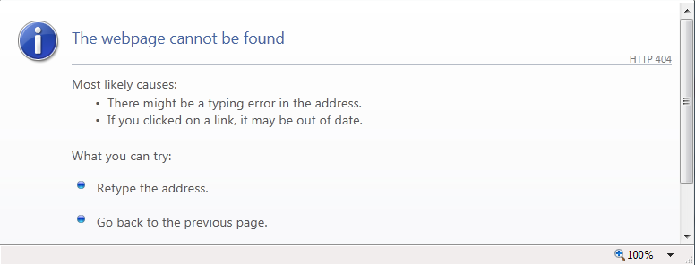

最近React项目遇到一个问题，当用户在IE11上刷新页面的时候会返回404错误页面。在其他浏览器上能够正常使用。
错误页面如下:




项目背景：<br/>
1， 利用 create react app 构建<br/>
2， 部署在tomcat上<br/>
3， 采用 H5 History 路由<br/>

服务端tomcat重定向的配置:
```xml
<error-page>
<error-code>404</error-code>
<location>/index.html</location>
</error-page>
```

---

解决问题的思路很清晰，由于这个错误页面只在IE下面出现，只需要了解该页面出现的机制就行。经过简单的搜索，我发现这个页面是IE 的 [Friendly HTTP Error Pages](https://blogs.msdn.microsoft.com/ieinternals/2010/08/18/friendly-http-error-pages/)。<br/>

自从IE5及以后的所有版本，如果服务端返回特定的错误码同时带的错误信息很短的话，IE会对用户显示上面那个更友好的错误页面。
而对于触发这个友好错误页面的条件有两个, 并且两个条件必须同时满足:

1. 服务端返回的 HTTP 状态码必须是 [400, 403, 404, 405, 406, 408, 409, 410, 500, 501, 505]
2. HTTP 的消息体 (Response body) 的字节长度必须小于一个阙值

对于状态码 [403,405,410]，默认阈值是256字节，对于响状态码 [400,404,406,408,409,500,501,505]，默认阈值是512字节。

经过检查，我们项目的index.html的大小果然是小于512字节，当tomcat把404重定向到index.html的时候触发了IE的友好错误页面显示。
